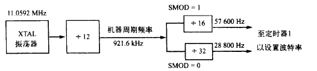
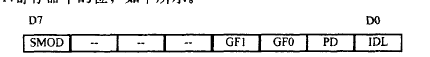
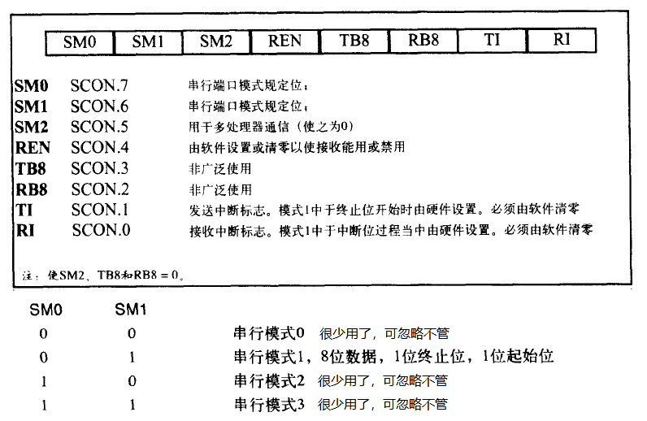

8051内置UART（通用异步收发器），8051诞生之前，与PC相连的设备都使用的是RS232标准。

像8051这类TTL(逻辑门电路）逻辑器件跟RS232其实是不兼容的，要想8051跟PC的串口相连，则需要转换。例如MAX232。

怎么理解串行通信呢？

可以想象有两条线连接着8051和PC，一条用于读（RxD），一条用于写（TxD）。

串行的含义就是分八次将八个bit在同一条线上发出去。接收方当然就是接收完八个bit后才能组成一个字节。

对于8051编程人员而言，只需要知道将字节往SBUF写或者从SBUF读就行了。（其实不需要按位移动逐个bit发送）

往SBUF写完之后，等待8051往串口进行发送，发送完之后，8051的TI会被设置为1。我们只需要监控这个bit就能知道是否可以继续往SBUF中写下一个字节了。

同样，读的时候可以监控RI位，当8051接收完一个字节之后，会把这个bit设置为1。

在读或者写完之后，我们需要将RI和TI手动设置为0，才能让8051知道继续处理下一个字节。

监控bit位太浪费机器周期。更合理的方式是配合中断。8051在收到一个字节或者发送一个字节之后都会产生中断。我们只需要写好中断处理程序就好了。（问题：串行中断号是多少？）

还剩下最重要的一个问题：'''定时器的计算'''。看下面这个图：

[[文件:串行通信频率计算.png]]

URAT使用定时器1作为频率计算的来源。意思是：'''每次定时器1计数翻转到00时，会触发一次URAT的高低点位变化！'''

每12个晶振周期是一个机器周期，'''而每32个机器周期就会让URAT触发一次定时器1的计数'''。

理解这个非常重要，这让URAT的周期“可编程”了。

如果定时器1计数的次数是X：

```bash
晶振频率：XTAL
机器周期：XTAL/12
URAT计数周期：(XTAL/12)/32
URAT数据传输周期：((XTAL/12)/32)/X
```

通常数据传输周期是固定的，比如9600、4800等。我们需要用已知的晶振频率和想要匹配的数据传输频率来到退定时器1需要计数的次数：

```bash
因为：((XTAL/12)/32)/X  = 9600
所以：XTAL/(12 * 32 * X) = 9600
      X = XTAL / (9600 * 12 * 32)
```

** 有一个小技巧 ** 

以8位定时器为例，当TH = 00H时，计数范围是00 - FF。

只需想想从00递增FF这个过程，如果把TH这四位当成无符号数，则数据是从0到255。

但是若当成有符号数看待的话，因为有补码的存在，则数是先从0递增到127，然后突然减到了-128。然后从-128递增到-1。

技巧是，如果我们想让定时器计数Y次，则可以这样做：`TH = -Y`。 而不用去计算`FF - Y`等于多少。`-Y`正好能表示离FF有`Y`个单位长度的数！


> 可以看到，补码在计算机中随时都能应用到！

** SMOD频率加倍 **
可以利用PCON中的SMOD位来使URAT计数周期加倍，这样就不是除32了，而是除16：



PCON是电源控制寄存器，它可位寻址，内容了解一下即可：



* 发送数据的过程：**
* 设置定时器为模式2（8位自动加载）
* 根据波特率计算并设置TH1
* 设置串口SCON寄存器（通常都是50H，表示使用串行模式1，支持接收）
* 启动定时器1
* 往SUB写数据，例如<code>MOV SBUF,#'A'</code>
* 监控TI位，如果为1表示已经发送完成了



串行通信中，寄存器的值好像都是固定的：

SCON = 01000000B (50H)  SM1和REN设置为1。

TMOD = 00100000B (20H)   模式2：八位定时器，自动重新加载